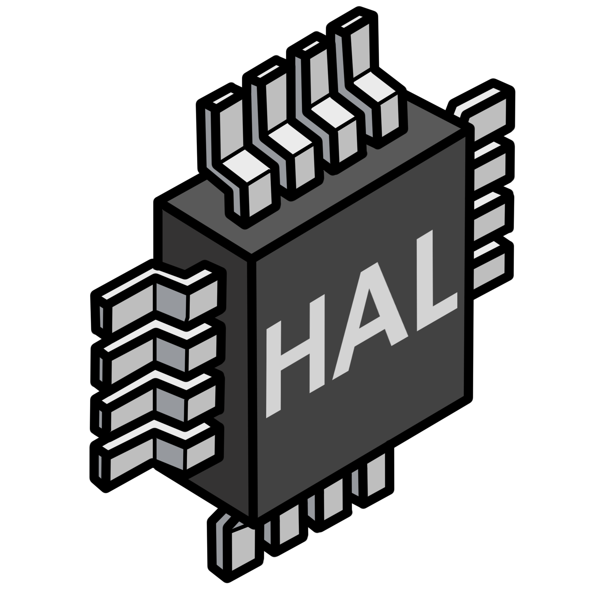

<div align="center">

<br />
<br />

```
🚚 portable 🦾 flexible 📦 accessible 🍰 easy to use
```
<br />
</div>

# libhal-util

libhal utility functions, interface wrappers, and types to help manage usage of
embedded resources.

<div align="center">

[](https://github.com/libhal/libhal-util/actions/workflows/docs.yml)
[](https://github.com/libhal/libhal-util/actions/workflows/lint.yml)
[](https://github.com/libhal/libhal-util/actions/workflows/tests.yml)
[](https://github.com/libhal/libhal/stargazers)
[](https://github.com/libhal/libhal/network)
[](https://github.com/libhal/libhal/issues)
[](https://codecov.io/gh/libhal/libhal)
[](https://www.codacy.com/gh/libhal/libhal/dashboard?utm_source=github.com&amp;utm_medium=referral&amp;utm_content=libhal/libhal&amp;utm_campaign=Badge_Grade)
[](https://discord.gg/p5A6vzv8tm)

[Install](#-install)
| [Overview](#ℹ%EF%B8%8F-overview)
| [Glossary](#-glossary)
| [Usage](#%EF%B8%8F-usage)
| [Badges](#-library-badges)
| [Standards](#-library-standards)
| [Libraries](#-libraries)
| [Motivation](#-motivation)
| [Contributing](#-contributing)

</div>

# [📚 Software APIs](https://libhal.github.io/libhal/api)